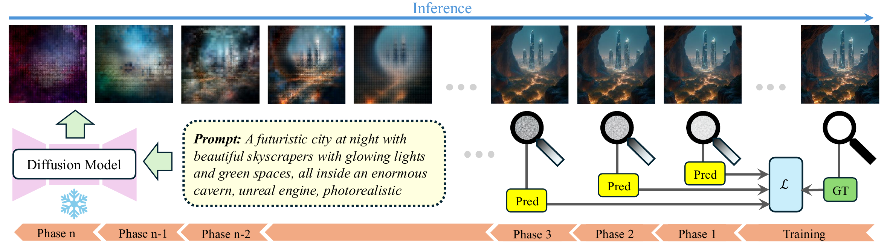

<h1 align="center"> TTSnap: Test-Time Scaling with Noise-Aware Pruning </h1>

<p align="center">
  <a href="https://terryslearning.github.io/" target="_blank">Qingtao&nbsp;Yu</a><sup>1</sup> &ensp; <b>&middot;</b> &ensp;
  <a href="https://charliesong1999.github.io/" target="_blank">Changlin&nbsp;Song</a><sup>1</sup> &ensp; <b>&middot;</b> &ensp;
  <span>Minghao&nbsp;Sun</span><sup>1</sup> &ensp; <b>&middot;</b> &ensp;
  <a href="https://scholar.google.com/citations?user=N8Nuv1kAAAAJ&hl=en" target="_blank">Zhengyang&nbsp;Yu</a><sup>1</sup> &ensp; <b>&middot;</b> &ensp;
  <span>Vinay&nbsp;Kumar&nbsp;Verma</span><sup>2</sup> &ensp; <b>&middot;</b> &ensp;
  <span>Soumya&nbsp;Roy</span><sup>2</sup> &ensp; <b>&middot;</b> &ensp;
  <span>Sumit&nbsp;Negi</span><sup>2</sup> &ensp; <b>&middot;</b> &ensp;
  <a href="https://users.cecs.anu.edu.au/~hongdong/" target="_blank">Hongdong&nbsp;Li</a><sup>1,2</sup> &ensp; <b>&middot;</b> &ensp;
  <a href="https://sites.google.com/view/djcampbell/" target="_blank">Dylan&nbsp;Campbell</a><sup>1</sup> &ensp; <b>&middot;</b> &ensp;
</p>

<p align="center">
  <sup>1</sup> Australian National University &emsp; 
  <sup>2</sup>Amazon Research &emsp; 
</p>

<p align="center">
  <a href="https://arxiv.org/pdf/2511.22242">📃 Paper</a> &ensp;
</p>


The official implementation of TTSnap.
More and more will be updated soon. 

We increase the efficiency of global search method for Test Time Scaling on Text to Image diffusion models, e.g. best-of-n. 

## 1. Generate Data

Given a set of text prompts, we generate training data by sampling from the diffusion model and storing the intermediate Tweedie-estimated images.

We use [NegToMe](https://github.com/1jsingh/negtome) increases the diversity of the images.

The generated datafile structure is like: 
```
# p represents the prompt 
# id represents each image 
# s represents the tweedie/ruler estimation decoded image at each timestep 
<data_folder_name>
    p0000
        id000
            s00
            s01 
            ...
            s19
        id001
        id002
        ...
        idxxx
    p0001
    p0002
    pxxxx
```

The code for generate the flux and sdxl data are in 'data/gen_flux.py' and 'data/gen_sdxl.py'.
```
# Environment Setup
pip install diffusers
# Run the code
python gen_flux.py
```

## 2. Train the Reward Model

We use our self-distillation strategy to finetune the reward model.

To train the noise-aware reward models, we introduce a curriculum self-distillation strategy that gradually shifts the training domain from clean images to increasingly noisy ones.
After one epoch at each noise level, we save the model weights and proceed to the next, ensuring small domain gaps and stable, efficient training.


### Environment:
```
conda create --n reward python=3.10.18
pip install image-reward
pip install peft
pip install transformers==4.53.1
pip install matplotlib
pip install scipy
pip install accelerate
pip install clint ftfy
```

### Checkpoints:
Original reward model checkpoints before finetuning: [link](https://drive.google.com/drive/folders/1Vzlba2rBCAEi9rUG_wrmttIfKGaLE1mk?usp=drive_link)

Reward checkpoints after finetuning: 


### Training Guidance: 
Modify the location of the datafolder and checkpoint path in the config file, e.g. c_flux.yaml. 

You can also use only part of data to train by modifying: *train_prompt_range*,  *train_num_per_prompt*. 

The prompts and the ground truth rewards of training and validation data is listed in reward_train/setup. 
Prompts are from imagereward training set. 

Commands for training: 
```
cd reward_train
accelerate launch --num_processes=<Number of your GPUs> train_cur.py \
    --c configs/imr_flux.yaml \
    --name <name of your choice, for saving the outputs> \
    --<other commands you need> 
```
Other arguments can be specified in the config file or add in the command lines

## 3. Run the TTSnap Offline Simulation

To avoid the prohibitive computational cost of real-time image generation during testing, we adopt an **offline simulation protocol**. This approach allows for **rapid** and **statistically robust** evaluation of various Test-Time Scaling (TTS) strategies by utilizing a pre-computed image pool.

### Reward Matrix Pre-computation:
We first generate an large image pool on the validation set. For each prompt, we record multiple generation trajectories and compute their corresponding reward values. This results in a reward tensor with the following dimensions: (*prompts_number*, *image_number_per_prompt*, *timestep_number*)

### Simulation Workflow:
The simulation operates on the fixed reward matrix rather than performing actual denoising. 

We use **Monte Carlo Sampling:**: randomly subsets trajectories from the pool to simulate real-world inference and evaluate performance. 

Advantages: 
- Ensures fairness by testing and comparing various **algorithms alternatives** and **different computation budgets** against a consistent, deterministic set of candidate samples trajectories.
- Rapid evaluations and Statistical robustness. 

Example (in simulation/ttsnap_single.ipynb, our pre-computed reward values are saved in simulation/values): 
```
'Compare TTSnap, TTSp and Best-of-N'
from ttsnap_sim import *

denoise_budget = 9.9 # TFlops
verifier_budget = 1.2 # TFlops

budget = 2000 
iters = 40

S = Simulation(x=denoise_budget, y=verifier_budget, max_step=num_steps)

# Best-of-N
n = int(budget / S.bon_cost())
print('Number of images seen in Best-of-N:', n)
r_bon, _ = S.bon_run(reward_base_all[:,:,-1], image_num_use=n, iters=iters)

# TTsnap
alphas = [0.4, 0.4, 0.5] # hyperparameters
steps_use = [2, 6, 11] # hyperparameters
n = int(budget / S.ttsp_cost(alpha_s=alphas, steps_use=steps_use))
print('Number of images seen in TTsnap:', n)
r_ttsp, _ = S.ttsp_run(reward_naft_all, image_num_use=n, alpha_s=alphas, steps_use=steps_use, iters=iters)

print('Averaged reward Best-of-N of all the prompts:', r_bon)
print('Averaged reward TTsnap of all the prompts:', r_ttsp)
```

TTSnap under multi-reward setting is in simulation/ttsnap_multi.ipynb

## 4. Run TTSnap

**TODO:** 
- [ ] release the code for TTSnap run
- [ ] link for trained checkpoints
- [ ] link for data

If you find our work useful, please cite: 
```
@article{yu2025ttsnap,
  title={TTSnap: Test-Time Scaling of Diffusion Models via Noise-Aware Pruning},
  author={Yu, Qingtao and Song, Changlin and Sun, Minghao and Yu, Zhengyang and Verma, Vinay Kumar and Roy, Soumya and Negi, Sumit and Li, Hongdong and Campbell, Dylan},
  journal={arXiv preprint arXiv:2511.22242},
  year={2025}
}
```

